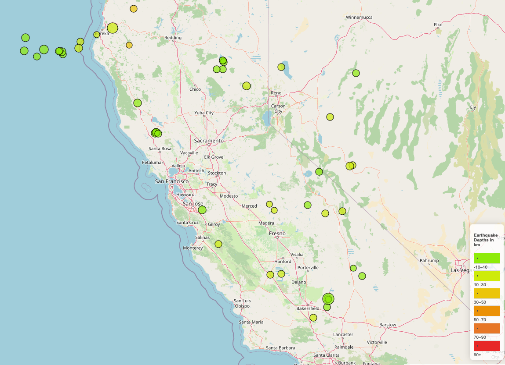

# Leaflet Challenge

## Overview
The goal of this project is to create an interactive map using Leaflet that visualizes earthquake data. Each earthquake is plotted based on its longitude and latitude. The size of the markers reflects the magnitude of the earthquake, while the color indicates the depth, with deeper earthquakes appearing in darker colors.

## Features

- **Dynamic Markers**: Each marker's size and color vary depending on the earthquake's magnitude and depth.
- **Popups**: Clicking on a marker displays a popup with more details about the earthquake.
- **Legend**: A legend is included to help users understand the marker colors in relation to the earthquake depths.

## Data Source

The earthquake data is fetched from the US Geological Survey (USGS). Specifically, the following API endpoint is used to retrieve data about earthquakes of magnitude 2.5+ that occurred in the last 30 days:

- [USGS Earthquakes Feed](https://earthquake.usgs.gov/earthquakes/feed/v1.0/summary/2.5_month.geojson)

## Visualization Example

Here is an example of how the map visualization might look:

## How to Run

To run this project locally, follow these steps:

1. Clone the repository to your local machine.
2. Open the `index.html` file in a web browser to view the map.
3. Ensure you have internet access to fetch the latest earthquake data from the USGS API.

## Technologies Used

- **Leaflet.js**: For creating interactive maps.
- **HTML/CSS**: For the web page structure and styling.
- **JavaScript**: For dynamic behavior on the web page.

## Acknowledgements
A tutor assisted with the legend.